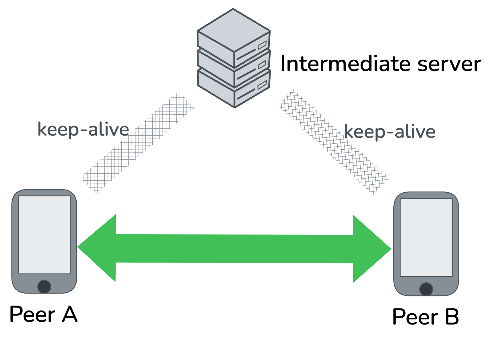
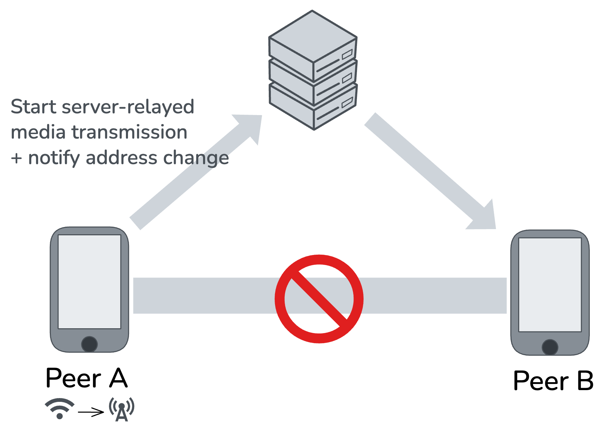
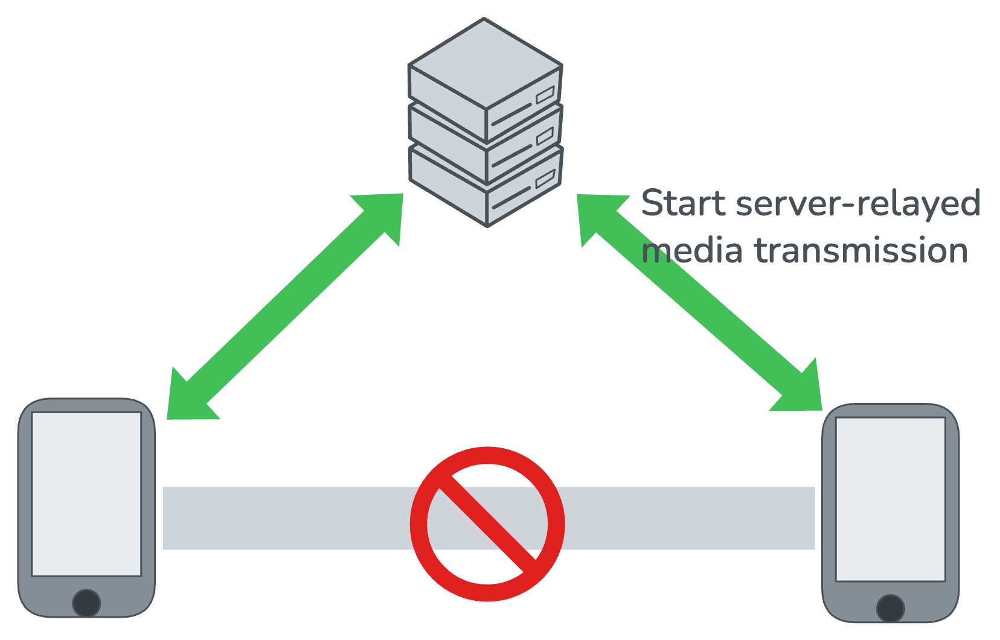
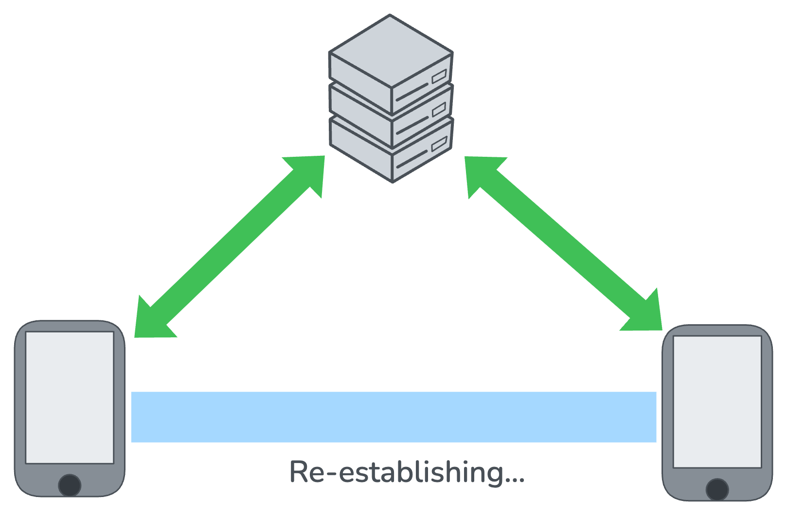
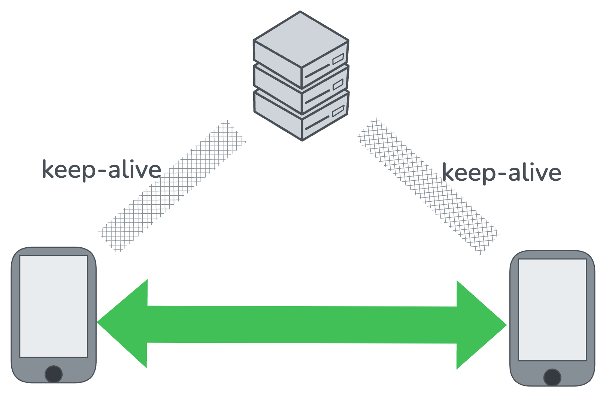

## Existing Approaches
### ICE Restart (WebRTC)
This method involves restarting the Interactive Connectivity Establishment (ICE) process to re-negotiate the network path after a change in the local network address (e.g., switching from Wi-Fi to cellular data). ICE Restart essentially re-establishes the entire WebRTC connection. This includes gathering new candidates, performing STUN/TURN checks, and re-completing the handshake protocol.

This process incurs a significant service interruption because the original media stream is halted until the new connection path is fully established. Experimental Evidence: Preliminary studies, using a WebRTC-based video conferencing service (e.g., Whereby), indicate a recovery time of approximately 8 seconds following an address change. This duration is substantial for real-time communication.

### ICE Renomination (WebRTC)
ICE Renomination allows the controlling ICE agent to change the selected (nominated) candidate pair after ICE has already completed, without restarting the entire ICE session. Practically, the endpoint performs connectivity checks on an already valid alternative pair and then nominates it (again) to switch traffic over, keeping the media session alive during the transition.

This method provides faster path switching than a full ICE Restart when a usable alternative pair already exists (e.g., pre-validated TURN relay or another host/srflx path), avoiding a new offer/answer and full candidate re-gathering, reducing signaling and setup overhead.

However, the renomination cannot introduce brand-new local candidates. If a device’s IP/interface changes and no previously gathered candidate remains valid, a full ICE Restart is still required to gather and advertise new candidates. In scenarios where pre-validated redundancy is feasible, renomination is complementary; otherwise, it is insufficient on its own for robust address-change recovery.

### Utilizing Multipath Connection
This method leverages multiple simultaneous network interfaces to maintain connectivity and enable seamless switching. A multipath connection maintains several active paths (e.g., using both Wi-Fi and cellular) concurrently. Upon failure or change in one path, the traffic can be instantly switched to another active path, eliminating the need for a full connection re-establishment.

Theoretically, this is the optimal approach for minimizing interruption time, as the switch to the redundant interface is nearly instantaneous.

However, maintaining multiple active interfaces significantly increases battery consumption. This is due to preventing the secondary network interface from entering a low-power sleep state. Also, multipath capability is primarily limited to mobile devices, which are typically equipped with multiple radio interfaces (Wi-Fi, cellular). Most standard desktop and laptop computers are restricted to a single active radio interface unless a wired connection (LAN) is also utilized.

Thus, this project proposes a universally applicable mechanism designed to minimize the service interruption time experienced during a Peer-to-Peer (P2P) connection following an IP address change.

## Proposed Method
The central premise of this project is the implementation of an immediate, temporary fallback to a server-relayed connection upon the detection of an IP address change, which minimizes service interruption while the Peer-to-Peer (P2P) link is re-established 

Two peers establish a direct P2P connection. Simultaneously, both peers maintain keep-alive sessions with an intermediate server. This server combines the functionality of a STUN, TURN and signaling server as utilized in standard ICE protocols.

Upon detecting a change in its IP address, Peer A immediately triggers the recovery protocol. Peer A first notifies the intermediate server of its new address. Crucially, Peer A then immediately switches its media transmission to flow through the intermediate server.

When the intermediate server receives the notification from Peer A, it forwards this status change to Peer B. Peer B, recognizing the failure of the direct P2P link, promptly begins sending its media stream to the intermediate server. At this stage, communication is considered recovered via the server-relayed path, ensuring minimal data loss and interruption.

With the connection successfully recovered via the server, both peers can now asynchronously attempt to re-establish a direct P2P link. This process can leverage the mechanisms of a standard ICE Restart, as the real-time media session is already guaranteed by the server relay and is no longer subject to critical interruption.

Once the new P2P connection path is successfully established and verified, both peers revert to transmitting media directly between themselves. The session returns to the original, optimized P2P state, and the intermediate server is no longer actively relaying media.

### Utilizing QUIC for transport
The proposed mechanism of an immediate server-relayed fallback cannot be directly implemented within the existing WebRTC framework due to the strict nature of the ICE protocol:
- Candidate Nomination Requirement: The ICE session establishment mandates a rigorous, multi-step process: candidate gathering, connectivity checks, and subsequent candidate nomination. A fallback to a TURN server-relayed connection is only possible after a relay candidate has been successfully nominated and checked.
- Protocol Violation: Implementing an immediate fallback would require bypassing or significantly modifying the candidate selection and nomination steps, thereby violating the core ICE protocol. While technically possible, this modification would compromise interoperability and adherence to established standards.

Instead of modifying ICE, this project proposes building a custom session establishment mechanism, similar in concept to WebRTC's, but utilizing QUIC as the underlying transport protocol. Utilizing QUIC provides several significant advantages that simplify the protocol stack and inherently support the goal of minimizing interruption time:
- Protocol Simplification and Consolidation: QUIC inherently provides functionality that is separately handled by multiple protocols in WebRTC. Specifically, QUIC can piggyback the security features of DTLS, most of the transport features of SCTP, and the control features of RTCP. This consolidation leads to a much simpler and more streamlined protocol stack.
- Connection Migration: QUIC's built-in connection migration feature allows a client to switch network paths while maintaining the connection's integrity. Crucially, QUIC's migration capability enables a connection to be re-established with a server much quicker than a conventional DTLS/TCP connection re-establishment. This rapid recovery significantly contributes to the minimization of the overall service interruption time.
