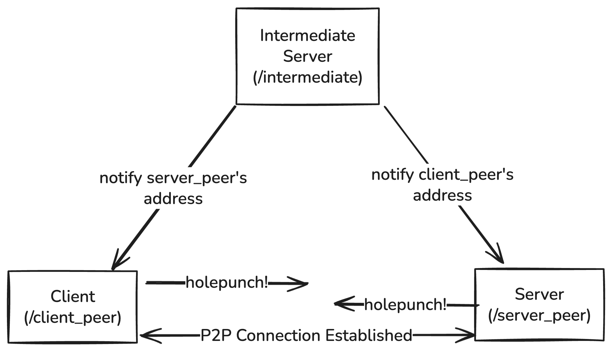

# p2p-quic-migration
P2P QUIC with seamless connection migration.

This project uses [modified quic-go](https://github.com/kota-yata/quic-go). Put this repository and quic-go at the same directory hierarchy and it will work (If not, let me know).



## Development
my man claude code has made some nice make commands:
```bash
# Run client (peer)
make client

# Run server (peer)
make server

# Run intermediate server
make intermediate

# Generate certs for servers. Running each componenet with make will automatically run this beforehand
make certs

# Build binaries
make build

# Test if gstreamer pipeline works
make gs-test
```
