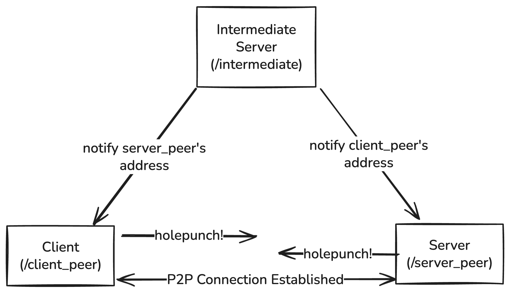
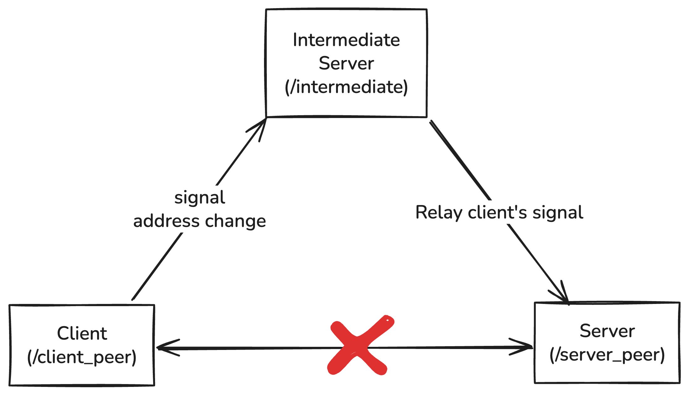
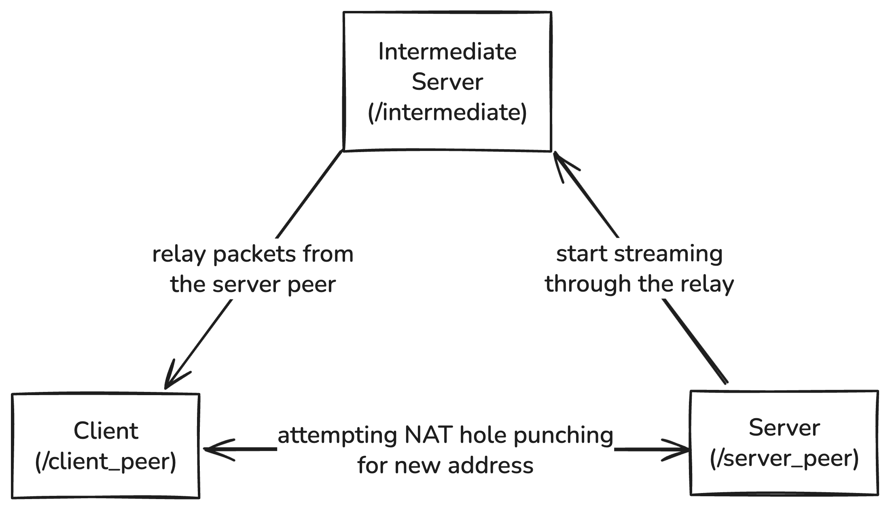
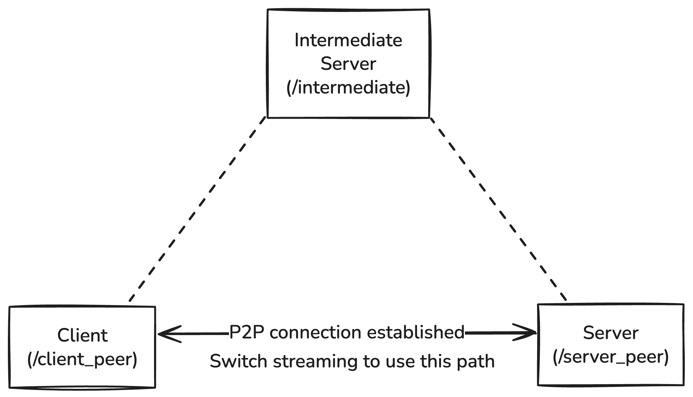

# p2p-quic-migration
P2P QUIC with seamless connection migration.

This project uses [modified quic-go](https://github.com/kota-yata/quic-go). Put this repository and quic-go at the same directory hierarchy and it will work (If not, let me know).

## Development
my man claude code has made some nice make commands:
```bash
# Run client (peer)
make client
# Run server (peer)
make server
# Run intermediate server
make intermediate
# Generate certs for servers. Running each componenet with make will automatically run this beforehand
make certs
# Build binaries
make build
# Test if gstreamer pipeline works
make gs-test
```

1. Run `make intermediate` somewhere
2. Run `make server` somewhere behind NAT
3. Run `make client` somewhere behind NAT

You need to run the client and server in different networks unless your router supports [NAT loopback](https://nordvpn.com/cybersecurity/glossary/nat-loopback/) a.k.a NAT hairpinning

If the connection is success, you should hear whatever the sound from static/output.mp3

## How P2P QUIC connection migration works
### P2P Connection Establishment


Steps here are pretty similar to WebRTC's approach, with a bit difference for simplicity.

#### Address Exchange
The client peer and server peer first connect to the intermediate server. The intermediate server retrieves each peer’s external address and exchanges them. Now that each peer has other party's address, they can start hole punching.

In WebRTC, this is done by a STUN server and a signaling server. a peer asks about its reflexive address(es) to the STUN server and notify them to the signaling server. the signaling server simply relays it to the other peers. In most cases WebRTC peers gather more than one address:port pair (called "candidate") including local addresses, because sometimes two peers in the same network want to connect to each other. This project does not handle local pair exchange at this point.

This project used to employ [QUIC Address Discovery](https://www.ietf.org/archive/id/draft-seemann-quic-address-discovery-00.html) to do STUN over QUIC type of approach. The draft basically defines OBSERVED_ADDRESS frame, which is equivalent to STUN's MAPPED_ADDRESS attribute, to notify peer's reflexive address. The frame is bundled in a probe packet, so it could be sent as quick as possible. In real-world scenario, this draft's approach will work nicer than how this project currently exchange addresses because a peer might want to gather its reflexive address from multiple servers for security reasons or determining NAT type or whatever reasons. This project now employs the intermediate server directly exchanging peer's addresses instead of notifying them back because this is simpler and enough for an experiment.

#### NAT Hole Punching
Now that both peers have other party's candidate, they can start NAT hole punching.

NAT hole punch is very common and required process in WebRTC or other p2p systems. Both peers send UDP packets to let NAT creates address map. These packets might not arrive thier destination as the counterpart might not have the NAT mapping yet, but it's totally fine. Eventually both network's router have proper mappings to their NAT tables, and the connection can be established like a conventional client-server connection. 

In this project, peers simply try to start QUIC connection from both sides again and again until one of the connection is established. Again, WebRTC hires much more concrete approach during ICE pair nomination. For every combination of the local candidates and remote candidates, a peer sends STUN Binding Request. The peer determines the final candidate pair by connectivity success, RTT, user's policy and many other factors. If a user force to use relay server, it selects connection through TURN server no matter what.

### Handling Address Change
There are cases where peer's address is changed and the connection no longer persistes. One of them is when you leave home and the network is switched to 5G from WiFi. In client-server connection over QUIC, this is handled nicely with famous "connection migration" feature. Instead of identifying connection by 4-tuple like TCP, QUIC identifies connections by Connection IDs. That way a server is aware of two packets from different source addresses is in the same connection.

This does not quite work in p2p scenarios only because NAT hole punch is required for every p2p connection. The packet from new address does't arrive in the first place blocked by NAT.

This project addresses this problem in a very simple way. When a client peer's address changes, it signals the change to the server peer through the intermediate server. 


The server peer then immediately start switch packet transmission from P2P connection to through the intermediate server. During NAT hole punch for the new address, application packets are sent from the server peer to the client peer through the interemediate server.


As soon as the NAT hole punch is done the packet transmission is switched back to using new p2p connection.


This approach is quite generic, meaning this could be applied to WebRTC or other systems. WebRTC handles address change by triggering ICE Restart, which basically does connection establishment step again. ICE Restart takes about 5 seconds or more as far as I've tested, and this project's approach can outperform this.

